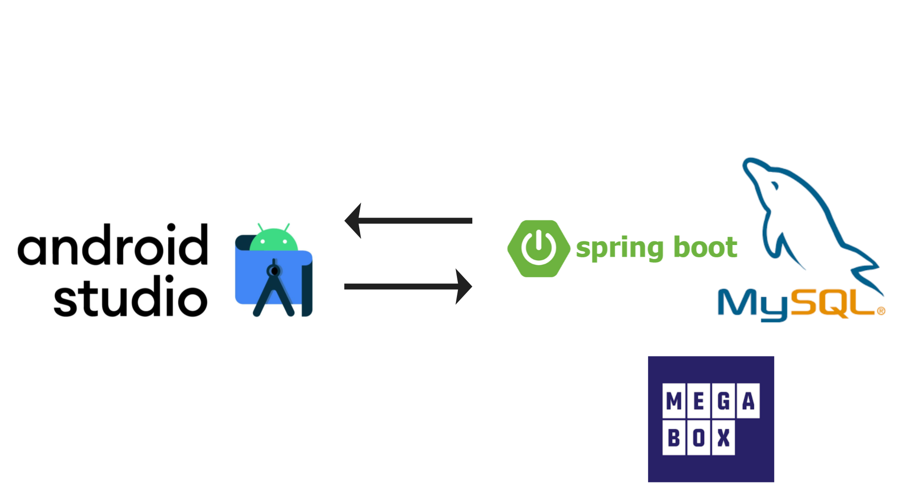
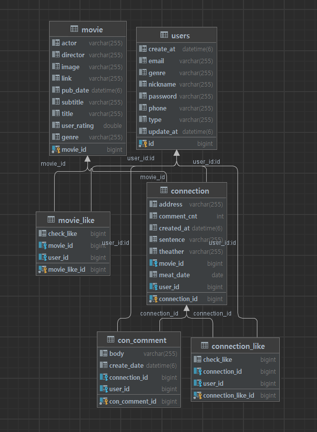

<head>
<link rel="preconnect" href="https://fonts.googleapis.com">
<link rel="preconnect" href="https://fonts.gstatic.com" crossorigin>
<link href="https://fonts.googleapis.com/css2?family=Nanum+Gothic+Coding&display=swap" rel="stylesheet">
</head>

  

</b> 
영화를 사랑하는 사람들을 연결하여 소셜 모임을 조직하는 어플  
사용자들이 공통된 영화 관심사를 기반으로 모임을 형성하고, 영화를 통한 소셜 모임을 촉진하여 교류와 친목을 증진시키는 플랫폼입니다.

 

<h2>📌 개요 </h2>
<ul>
    <li>프로젝트 이름 : Cinemate  - 같이 영화 볼래? </li>
    <li>개발 기간 : 2023.11.30 ~ 2023.12.17</li> 
    <li>개발 엔진 및 언어: Android & Spring Boot</li>
    <li>2023-2 모바일 프로그래밍 term project</li>
</ul>

 

<h2>⚙ Stacks</h2>

<h4> Environment </h4>

<h4> Development </h4>

[//]: # (![]&#40;https://img.shields.io/badge/-?style=for-the-badge&logo=Strapi&logoColor=white&#41;)

[//]: # (![]&#40;https://img.shields.io/badge/-?style=for-the-badge&logo=Next.js&logoColor=white&#41;)

<h4> Communication </h4>

 

<h2>🤔 문제 정의</h2>

현대 사회에서의 개인화와 디지털화로 인해 혼자 시간을 보내는 경우가 많아졌습니다.

이 어플인 ‘시네메이트’는 사회적 연결을 강화하고, 영화를 통해서 소셜 모임을 유도하여 사람들 간 교류와 친목을 증진시키고자 합니다.

 
 

<h2>⚙️ 서비스 소개</h2>

<h5> ✔️ 사용자들에게 새로운 영화 경험과 인연 제공을 목표로 하는 소셜 영화 플랫폼 </h5>

<h5> ✔️ 영화 관심 기반의 모임 형성으로 교류와 친목 촉진 </h5>

<h5> ️️️✔️ 대중적인 영화를 통해 다양한 연령층 연결 </h5>

<h5> ✔️ 지역 주변의 다양한 영화 모임 제공, 다양성 강조 </h5>

<h5> ✔️ 모임 일정, 장소, 참여 신청 등 편의성 강화 </h5>

 
 

<h2>📱 화면 구성</h2>
<table>
<tr>
    <th>로그인 페이지</th>
    <th>회원가입 페이지</th>
    <th>로그아웃 페이지</th>
</tr>
<tr align="center">
    <td> </td>
    <td> </td>
    <td> </td>
</tr>
<tr>
    <th >홈 페이지</th>
    <th >홈 - 더보기 페이지</th>
    <th >모임 페이지</th>
    <th >모임방 만들기</th>
</tr>
<tr align="center">
    <td> </td>
    <td> </td>
    <td> </td>
    <td> </td>

</tr>
<tr>
 
    <th >모임방 검색</th>
    <th >모임방 더보기</th>
    <th >검색</th>
    <th >마이페이지</th>
</tr>
<tr align="center">
    
    <td> </td>
    <td> </td>
    <td> </td>
    <td> </td>
</tr>

</table>

 
 

<h2>🔎 아키텍쳐</h2>

 

<h2>🛠 DB 다이어그램</h2>

 

